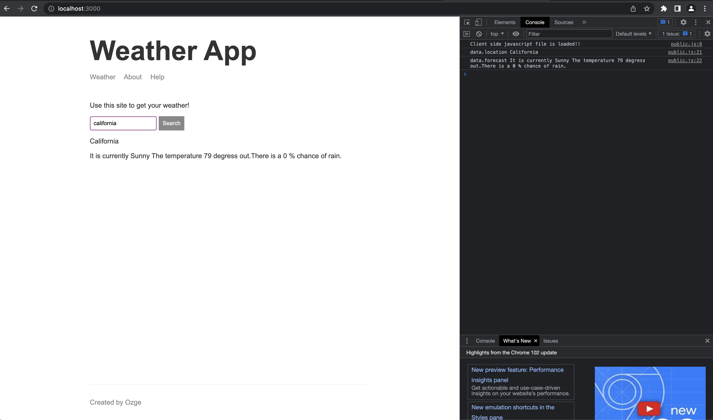
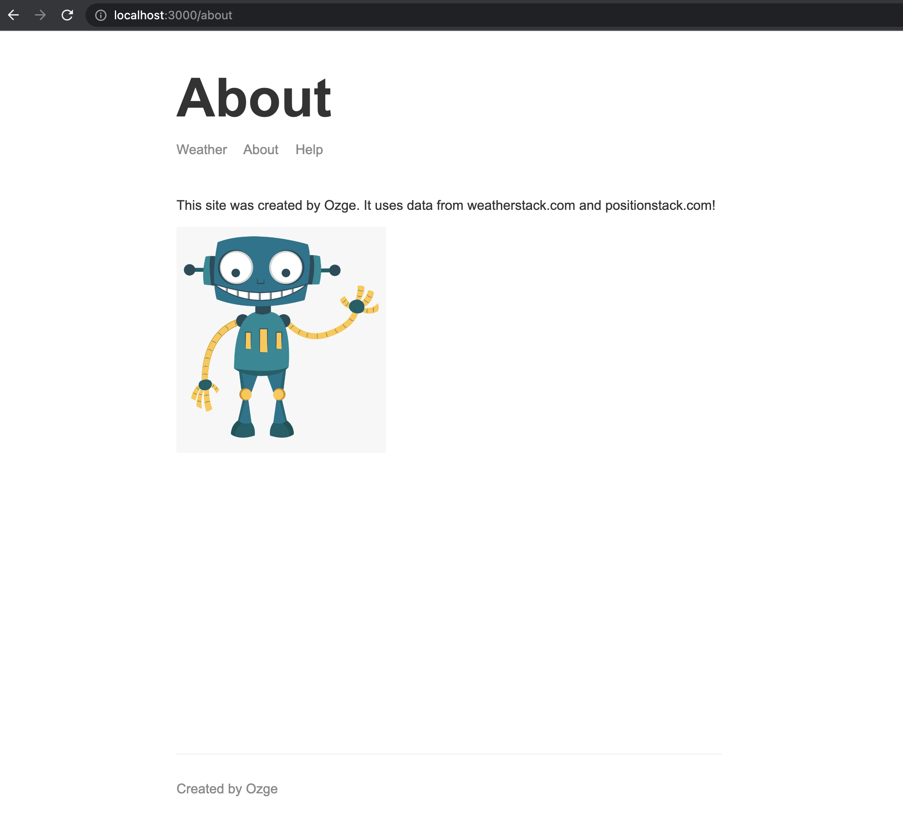

# weather-app

## Set up

Install all dependencies `npm install`

## Run Script

Access the project in weather-app/web-server directory 
Start the application `nodemon src/app.js -e js,hbs`

### Screenshot of Weather App

#### Home Weather Page 

#### About Page 

